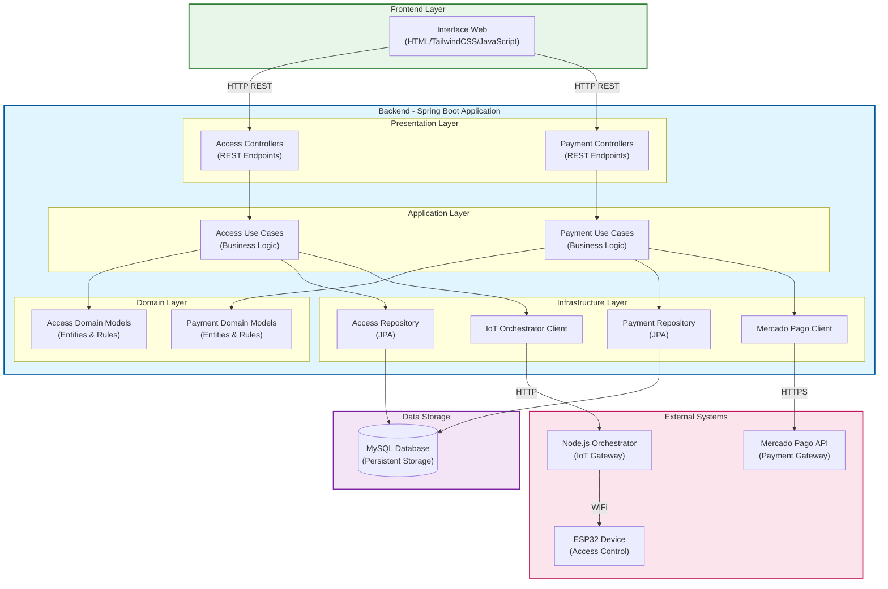
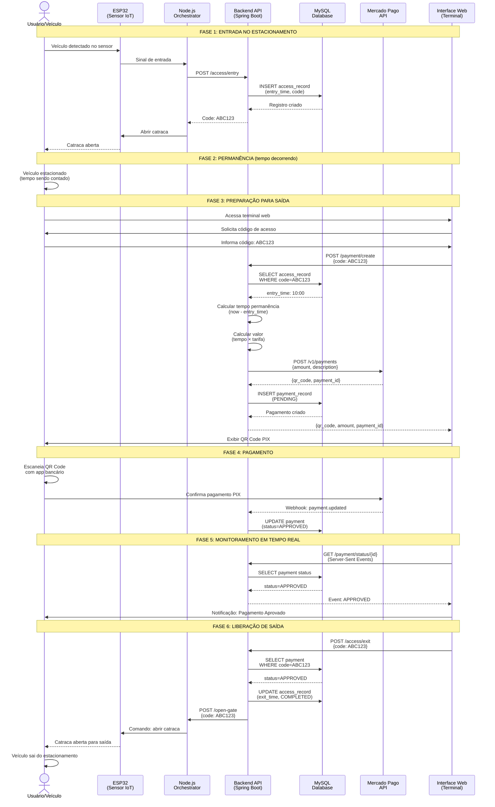

<div align="center">
  
# Libera.ai

### Plataforma Inteligente de Gestão de Estacionamentos com Pagamento Automático

[](https://openjdk.java.net/)
[](https://spring.io/projects/spring-boot)
[](https://spring.io/)
[](https://www.mysql.com/)
[](https://www.mercadopago.com.br/)
[](https://www.docker.com/)
[](LICENSE)

</div>

---

## Índice

- [Problema](#problema)
- [Solução](#solução)
- [Objetivos do Projeto](#objetivos-do-projeto)
- [Arquitetura do Sistema](#arquitetura-do-sistema)
- [Fluxo do Sistema](#fluxo-do-sistema)
- [Abordagem Técnica](#abordagem-técnica)
- [Estrutura do Repositório](#estrutura-do-repositório)
- [Configuração e Instalação](#configuração-e-instalação)
- [Tecnologias Utilizadas](#tecnologias-utilizadas)
- [Documentação Técnica Detalhada](#documentação-técnica-detalhada)
- [Licença](#licença)

---

## Problema

A gestão de estacionamentos comerciais enfrenta desafios como processos manuais lentos e propensos a erros, dificuldade em integrar métodos de pagamento modernos (PIX), falta de automação em cancelas, e sistemas legados difíceis de escalar. Isso resulta em filas longas, experiência ruim para o usuário e custos operacionais elevados.

---

## Solução

O **Libera.ai** é uma plataforma completa de gestão de estacionamentos que automatiza todo o ciclo operacional, desde a entrada do veículo até a saída com pagamento validado. A solução integra controle de acesso físico via IoT, processamento de pagamentos via PIX, e interface web responsiva em uma arquitetura modular e escalável.

### Componentes Principais

**1. Módulo de Controle de Acesso**
- Registro automático de entrada de veículos com geração de código único
- Validação de saída com verificação de entrada prévia e pagamento
- Rastreamento completo de horários de entrada e saída
- Integração com catracas/cancelas via ESP32 e Node.js orchestrator
- Interface web para operação de terminais de saída

**2. Módulo de Pagamentos**
- Geração automática de pagamentos PIX via integração com Mercado Pago
- Cálculo de tarifa baseado em tempo de permanência (configurável)
- Geração de QR Code dinâmico para pagamento instantâneo
- Monitoramento de status de pagamento em tempo real via Server-Sent Events (SSE)
- Validação de pagamento antes da liberação de saída

**3. Camada de Apresentação**
- Interface web responsiva construída com HTML5 e TailwindCSS
- Design mobile-first para acesso em diferentes dispositivos
- Feedback visual em tempo real sobre status de operações
- Notificações de erro e sucesso
- Cálculo e exibição automática de tempo de permanência e valor a pagar

**4. Camada de Infraestrutura**
- Persistência de dados em MySQL com histórico completo de transações
- Containerização completa com Docker para facilitar deployment
- Orquestração de serviços via Docker Compose
- Configuração centralizada via variáveis de ambiente

---

## Objetivos do Projeto

O Libera.ai visa automatizar operações de estacionamento, melhorar a experiência do usuário com pagamento digital rápido, garantir rastreabilidade completa das transações, e criar uma arquitetura modular e escalável usando Clean Architecture e DDD.

---

## Arquitetura do Sistema

### Visão Geral da Arquitetura

O Libera.ai foi projetado seguindo princípios de **Clean Architecture** e **Domain-Driven Design (DDD)**, organizando o código em **bounded contexts** independentes que representam diferentes domínios de negócio.



### Descrição das Camadas

O sistema é dividido em 4 camadas principais seguindo Clean Architecture:

- **Presentation**: Controllers REST e DTOs para comunicação com clientes
- **Application**: Use Cases que orquestram a lógica de negócio
- **Domain**: Entidades e regras de negócio puras, independentes de frameworks
- **Infrastructure**: Implementações técnicas (JPA, Mercado Pago, IoT)

---

## Fluxo do Sistema

### Fluxo Completo: Entrada até Saída

O sistema opera em um ciclo completo que vai desde a detecção de entrada do veículo até a liberação de saída após pagamento confirmado.



### Detalhamento das Fases

**FASE 1: Entrada**  
Sensor ESP32 detecta veículo → Node.js orchestrator chama API → Sistema gera código único → Catraca abre

**FASE 2: Permanência**  
Veículo estacionado, tempo sendo contabilizado

**FASE 3: Preparação para Saída**  
Usuário informa código no terminal web → Sistema calcula tempo e valor → Gera QR Code PIX via Mercado Pago

**FASE 4: Pagamento**  
Usuário paga via PIX → Webhook notifica backend → Status atualizado no banco

**FASE 5: Monitoramento**  
Interface mantém conexão SSE → Backend envia eventos de atualização → Interface libera saída quando aprovado

**FASE 6: Liberação**  
Sistema valida pagamento → Envia comando para abrir catraca → Veículo sai

---

## Abordagem Técnica

O sistema utiliza **Clean Architecture** e **DDD** para manter o código modular e escalável. Os módulos Access e Payment são bounded contexts independentes, permitindo evolução separada. 

Principais decisões técnicas:
- **WebFlux + Virtual Threads**: Programação reativa para alta performance em operações I/O
- **Server-Sent Events (SSE)**: Atualizações em tempo real do status de pagamento
- **Hexagonal Architecture**: Portas e adaptadores isolam lógica de negócio das implementações técnicas
- **Separação em Camadas**: Presentation, Application, Domain e Infrastructure bem definidas

---

## Estrutura do Repositório

```
Libera.ai/
├── back/                          # Backend - API REST (Java/Spring Boot)
│   ├── src/
│   │   ├── main/
│   │   │   └── java/br/centroweg/libera_ai/
│   │   │       ├── module/
│   │   │       │   ├── access/           # Módulo de Controle de Acesso
│   │   │       │   │   ├── presentation/    # Controllers, DTOs
│   │   │       │   │   ├── application/     # Use Cases
│   │   │       │   │   ├── domain/          # Entidades, Portas
│   │   │       │   │   └── infrastructure/  # Repositórios, Adaptadores
│   │   │       │   │
│   │   │       │   └── payment/          # Módulo de Pagamentos
│   │   │       │       ├── presentation/    # Controllers, DTOs
│   │   │       │       ├── application/     # Use Cases
│   │   │       │       ├── domain/          # Entidades, Portas
│   │   │       │       └── infrastructure/  # Repositórios, Mercado Pago
│   │   │       │
│   │   │       └── share/            # Código compartilhado
│   │   │           ├── config/          # Configurações Spring
│   │   │           └── exception/       # Exceções globais
│   │   │
│   │   └── resources/
│   │       └── application.yml      # Configuração da aplicação
│   │
│   ├── Dockerfile                   # Container da aplicação
│   ├── compose.yml                  # Orquestração Docker (app + MySQL)
│   ├── pom.xml                      # Dependências Maven
│   └── README.md                    # Documentação técnica detalhada
│
└── front/                         # Frontend - Interface Web
    └── index.html                 # Terminal de saída (HTML/TailwindCSS/JS)
```

### Organização Modular

O backend segue uma estrutura modular baseada em **Bounded Contexts** do DDD:

- **Access Module**: Gerencia entrada e saída de veículos, controle de acesso físico
- **Payment Module**: Gerencia criação e acompanhamento de pagamentos
- **Shared**: Contém código compartilhado entre módulos (configurações, exceções)

Cada módulo segue a estrutura de Clean Architecture:
- **Presentation**: Interface com o mundo externo (REST API)
- **Application**: Casos de uso e orquestração
- **Domain**: Lógica de negócio pura e entidades
- **Infrastructure**: Detalhes de implementação (banco, APIs externas)

---

## Configuração e Instalação

### Pré-requisitos

- **Docker** 20+ e **Docker Compose** 1.29+
- **Token de acesso do Mercado Pago** ([obter aqui](https://www.mercadopago.com.br/developers))
- **Node.js Orchestrator** (gateway entre backend e ESP32)

### Passo 1: Configurar Variáveis de Ambiente

Crie o arquivo `.env` na pasta `back/`:

```env
# Configurações do Banco de Dados MySQL
DB_ROOT_PASSWORD=sua_senha_root_segura
DB_NAME=libera_db
DB_USER=libera_user
DB_PASSWORD=sua_senha_usuario_segura

# Credenciais do Mercado Pago
MERCADOPAGO_ACCESS_TOKEN=seu_access_token_mercadopago

# Configurações do Node.js Orchestrator (IoT Gateway)
NODE_HOST=172.17.0.1
NODE_PORT=3000
```

**Notas importantes**:
- O `MERCADOPAGO_ACCESS_TOKEN` pode ser obtido no [painel de desenvolvedores do Mercado Pago](https://www.mercadopago.com.br/developers)
- Use tokens de **teste** durante desenvolvimento e **produção** apenas em ambiente real
- O `NODE_HOST` deve apontar para o endereço onde o orchestrator Node.js está rodando
- Ajuste as senhas do banco de dados para senhas fortes em ambiente de produção

### Passo 2: Iniciar os Serviços

```bash
cd back/
docker compose up -d --build
```

Este comando irá:
1. Construir a imagem Docker da aplicação Spring Boot
2. Iniciar container MySQL com as configurações especificadas
3. Iniciar container da aplicação
4. Criar automaticamente as tabelas no banco de dados (via JPA/Hibernate)

### Passo 3: Verificar a Instalação

**API Backend**:
```bash
curl http://localhost:8080/actuator/health
```

Resposta esperada:
```json
{
  "status": "UP"
}
```

**Banco de Dados**:
```bash
docker exec -it libera-mysql mysql -u libera_user -p libera_db
```

### Passo 4: Acessar a Aplicação

- **API Backend**: http://localhost:8080
- **Health Check**: http://localhost:8080/actuator/health
- **Terminal Web**: Abra o arquivo `front/index.html` em um navegador
  - Certifique-se de que o navegador pode acessar `http://localhost:8080`

### Comandos Úteis

**Ver logs da aplicação**:
```bash
docker compose logs -f app
```

**Ver logs do MySQL**:
```bash
docker compose logs -f mysql
```

**Parar os serviços**:
```bash
docker compose down
```

**Reiniciar os serviços**:
```bash
docker compose restart
```

**Limpar dados e recomeçar**:
```bash
docker compose down -v  # Remove volumes (dados do banco)
docker compose up -d --build
```

---

## Tecnologias Utilizadas

### Backend

| Categoria | Tecnologia | Versão | Propósito |
|-----------|-----------|--------|-----------|
| **Linguagem** | Java | 21 LTS | Linguagem principal com virtual threads |
| **Framework** | Spring Boot | 3.5 | Framework principal da aplicação |
| **Web Framework** | Spring WebFlux | 6.x | Programação reativa e SSE |
| **Persistência** | Spring Data JPA | 3.x | Abstração de acesso a dados |
| **ORM** | Hibernate | 6.x | Mapeamento objeto-relacional |
| **Banco de Dados** | MySQL | 8.0 | Armazenamento persistente |
| **Pagamentos** | Mercado Pago SDK | Última | Integração com gateway de pagamentos |
| **Containerização** | Docker | 20+ | Containerização da aplicação |
| **Orquestração** | Docker Compose | 1.29+ | Gerenciamento multi-container |

### Frontend

| Categoria | Tecnologia | Propósito |
|-----------|-----------|-----------|
| **Estrutura** | HTML5 | Marcação semântica |
| **Estilização** | TailwindCSS | Framework CSS utilitário |
| **Interatividade** | Vanilla JavaScript | Lógica do cliente e comunicação com API |
| **Tempo Real** | Server-Sent Events (SSE) | Atualizações de status em tempo real |

### IoT / Hardware

| Categoria | Tecnologia | Propósito |
|-----------|-----------|-----------|
| **Microcontrolador** | ESP32 | Controle de catracas/cancelas |
| **Gateway** | Node.js | Orchestrator entre backend e ESP32 |
| **Protocolo** | HTTP/WiFi | Comunicação entre componentes |

### DevOps e Infraestrutura

| Categoria | Tecnologia | Propósito |
|-----------|-----------|-----------|
| **Build Tool** | Maven | Gerenciamento de dependências e build |
| **Monitoramento** | Spring Actuator | Health checks e métricas |
| **Logging** | SLF4J + Logback | Sistema de logs |

---

## Documentação Técnica Detalhada

Este README apresenta uma visão geral do projeto. Para documentação técnica completa, incluindo:

- **Arquitetura Detalhada**: Diagramas de camadas, fluxos de dados, decisões arquiteturais
- **API Endpoints**: Documentação completa de todos os endpoints REST
- **Modelos de Dados**: Esquemas de banco de dados e relacionamentos
- **Casos de Uso**: Descrição detalhada de cada operação de negócio
- **Integrações Externas**: Detalhes sobre Mercado Pago, ESP32, webhooks
- **Configurações Avançadas**: Opções de configuração e tuning de performance
- **Guias de Desenvolvimento**: Como adicionar novos módulos ou funcionalidades

**Consulte**: [back/README.md](./back/README.md)

---

## Licença

Este projeto está licenciado sob a **GNU General Public License v2.0**.

A GPL v2.0 é uma licença de software livre que garante aos usuários finais as liberdades de usar, estudar, compartilhar e modificar o software. Para mais detalhes, consulte o arquivo [LICENSE](LICENSE).

---

## Autores

**Centro WEG**

Projeto desenvolvido com foco em arquitetura limpa, qualidade de código e boas práticas de engenharia de software.
