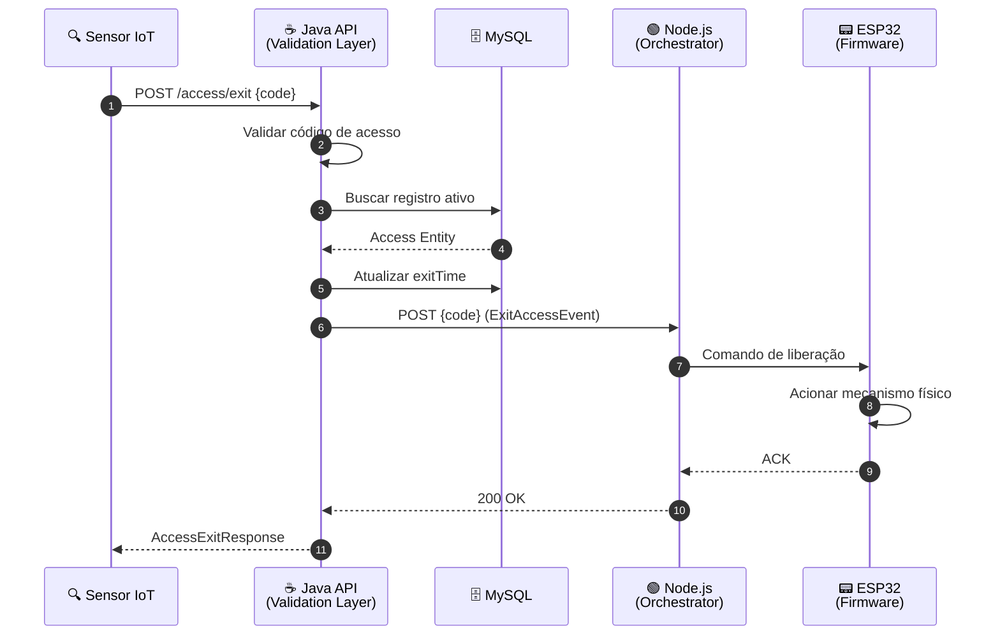
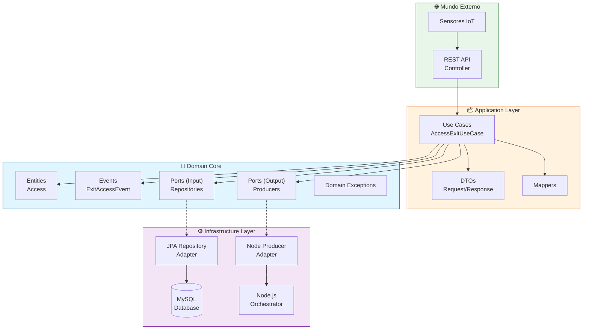
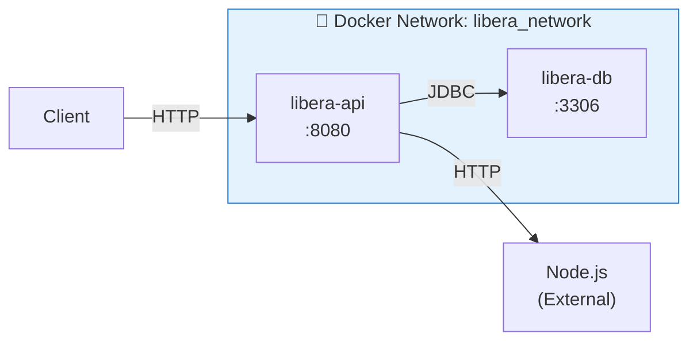
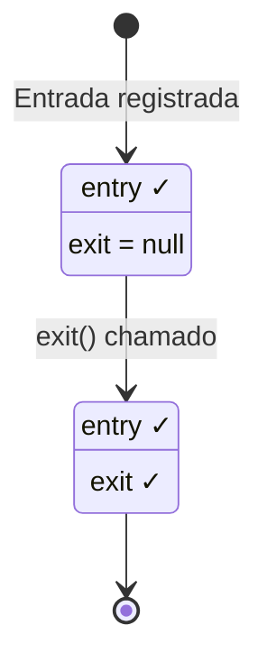

<div align="center">
  
# 🔐 Libera.ai

### Ecossistema IoT de Alta Performance para Controle de Acesso

[](https://openjdk.java.net/)
[](https://spring.io/projects/spring-boot)
[](https://www.mysql.com/)
[](https://www.docker.com/)
[](LICENSE)

</div>

---

## 📋 Índice

- [Conceito do Projeto](#-conceito-do-projeto)
- [Tech Stack](#-tech-stack)
- [Arquitetura](#-arquitetura)
- [Estrutura de Pastas](#-estrutura-de-pastas)
- [Setup & Running](#-setup--running)
- [Entidade Access](#-entidade-access)
- [Detalhes de Engenharia](#-detalhes-de-engenharia)
- [API Endpoints](#-api-endpoints)

---

## 💡 Conceito do Projeto

O **Libera.ai** é um ecossistema IoT completo para **controle de acesso físico inteligente**, projetado para resolver os desafios de gerenciamento de entrada e saída em ambientes corporativos, industriais e residenciais.

### 🎯 Problema Resolvido

| Desafio | Solução Libera.ai |
|---------|-------------------|
| Controle de acesso manual e propenso a erros | Validação automatizada via sensores IoT |
| Falta de rastreabilidade de entradas/saídas | Registro completo com timestamps em banco de dados |
| Integração complexa entre hardware e software | Arquitetura desacoplada com comunicação via eventos |
| Dificuldade de escalabilidade | Clean Architecture preparada para crescimento |

### 🔄 Fluxo de Funcionamento

1. **Sensor IoT** detecta código de acesso
2. **API Java** valida o código e registra entrada/saída
3. **Orchestrator Node.js** recebe comando de liberação
4. **ESP32** aciona o mecanismo físico de abertura

---

## 🛠 Tech Stack

### Backend (Core)

| Tecnologia | Versão | Propósito |
|------------|--------|-----------|
|  | 21 LTS | Runtime principal com Virtual Threads |
|  | 3.5.11 | Framework de aplicação |
|  | - | ORM e persistência |
|  | - | Redução de boilerplate |

### Middleware & Infraestrutura

| Tecnologia | Propósito |
|------------|-----------|
|  | Orquestração de comandos IoT |
|  | Persistência de dados |
|  | Containerização e orquestração |

### Hardware (IoT)

| Componente | Função |
|------------|--------|
|  | Microcontrolador para acionamento físico |
| Sensores RFID/NFC | Leitura de códigos de acesso |
| Relés/Fechaduras | Mecanismo de liberação física |

---

## 🏗 Arquitetura

O Libera.ai foi construído seguindo os princípios de **Clean Architecture** e **Domain-Driven Design (DDD)**, garantindo separação de responsabilidades, testabilidade e facilidade de manutenção.

### Diagrama de Sequência - Fluxo de Saída



### Arquitetura Hexagonal (Ports & Adapters)



---

## 📂 Estrutura de Pastas

A organização segue estritamente os princípios de **Clean Architecture** e **DDD**:

```
src/main/java/br/centroweg/libera_ai/
│
├── Application.java                    # 🚀 Bootstrap da aplicação
│
├── application/                        # 📦 CAMADA DE APLICAÇÃO
│   ├── controller/                     # Controllers REST
│   │   └── AccessController.java       # Endpoints de acesso
│   ├── dto/                            # Data Transfer Objects
│   │   ├── AccessExitRequest.java      # Request de saída
│   │   └── AccessExitResponse.java     # Response de saída
│   ├── mapper/                         # Conversores Domain ↔ DTO
│   │   └── AccessMapper.java           # Mapper de Access
│   └── use_case/                       # Casos de Uso (Application Services)
│       └── AccessExitUseCase.java      # Lógica de saída
│
├── domain/                             # 💎 CAMADA DE DOMÍNIO (Core)
│   ├── event/                          # Eventos de Domínio
│   │   └── ExitAccessEvent.java        # Record: Evento de saída
│   ├── exception/                      # Exceções de Domínio
│   │   ├── AccessCodeNotValidException.java
│   │   └── AccessDomainException.java
│   ├── model/                          # Entidades de Domínio
│   │   └── Access.java                 # Entidade principal
│   └── port/                           # Portas (Interfaces)
│       ├── AccessRepository.java       # Port: Repositório
│       └── ExitEventProducer.java      # Port: Produtor de eventos
│
└── infrastructure/                     # ⚙️ CAMADA DE INFRAESTRUTURA
    ├── persistence/                    # Adapters de persistência
    │   ├── entity/
    │   │   └── AccessEntity.java       # JPA Entity (Record)
    │   └── repository/
    │       ├── AccessRepositoryAdapter.java  # Implementa Port
    │       └── JpaAccessRepository.java      # Spring Data JPA
    └── producer/                       # Adapters de mensageria
        └── NodeExitEventProducer.java  # Comunicação com Node.js
```

### Princípios Aplicados

| Camada | Responsabilidade | Dependências |
|--------|------------------|--------------|
| **Domain** | Regras de negócio puras | Nenhuma dependência externa |
| **Application** | Orquestração de casos de uso | Depende apenas de Domain |
| **Infrastructure** | Implementações técnicas | Implementa interfaces de Domain |

---

## 🚀 Setup & Running

### Pré-requisitos

- Docker 20+ e Docker Compose
- (Opcional) Java 21 e Maven 3.9+ para desenvolvimento local

### 1. Configuração do Ambiente

Crie o arquivo `.env` na raiz do projeto:

```env
# Banco de Dados
DB_ROOT_PASSWORD=sua_senha_root_segura
DB_NAME=libera_db
DB_USER=libera_user
DB_PASSWORD=sua_senha_segura
DB_PORT=3306

# Aplicação
APP_PORT=8080

# Integração Node.js
NODE_HOST=172.17.0.1
NODE_PORT=3000
```

### 2. Executando com Docker Compose

```bash
# Build e inicialização completa
docker compose up -d --build

# Verificar status dos containers
docker compose ps

# Acompanhar logs
docker compose logs -f api
```

### 3. Verificando a Saúde do Sistema

```bash
# Health check da API
curl http://localhost:8080/actuator/health
```

### Arquitetura Docker



---

## 📊 Entidade Access

A entidade `Access` é o **Aggregate Root** do domínio, representando um registro de acesso com entrada e saída.

### Estrutura da Entidade

```java
public class Access {
    private final int id;           // Identificador único
    private final int code;         // Código do cartão/credencial
    private final LocalDateTime entry;  // Timestamp de entrada
    private LocalDateTime exit;     // Timestamp de saída (null = ativo)
}
```

### Schema do Banco de Dados

| Campo | Tipo | Descrição | Constraints |
|-------|------|-----------|-------------|
| `id` | `INT` | Identificador único | PK, AUTO_INCREMENT |
| `code` | `INT` | Código de acesso | NOT NULL |
| `entry` | `DATETIME` | Data/hora de entrada | NOT NULL |
| `exit` | `DATETIME` | Data/hora de saída | NULLABLE |

### Ciclo de Vida



---

## ⚡ Detalhes de Engenharia

### Spring Boot Layertools

O Dockerfile utiliza **multi-stage builds** com `spring-boot-layertools` para otimização de cache:

```dockerfile
# Stage 1: Build com extração de camadas
RUN mvn clean package -DskipTests -B && \
    java -Djarmode=layertools -jar target/*.jar extract --destination target/extracted

# Stage 2: Cópia otimizada por camadas
COPY --from=build /app/target/extracted/dependencies/ ./
COPY --from=build /app/target/extracted/spring-boot-loader/ ./
COPY --from=build /app/target/extracted/snapshot-dependencies/ ./
COPY --from=build /app/target/extracted/application/ ./
```

**Benefícios:**
- ✅ Rebuild apenas das camadas modificadas
- ✅ Cache eficiente de dependências Maven
- ✅ Imagens de produção menores (~150MB)

### Thread-Safety com DateTimeFormatter

O `AccessMapper` utiliza `DateTimeFormatter` de forma thread-safe:

```java
// ✅ Correto: DateTimeFormatter é imutável e thread-safe
private static final DateTimeFormatter FORMATTER = 
    DateTimeFormatter.ofPattern("dd/MM/yyyy HH:mm:ss");
```

**Por que isso importa:**
- `DateTimeFormatter` é imutável (diferente do legado `SimpleDateFormat`)
- Instância estática compartilhada entre todas as threads
- Zero overhead de sincronização

### Comunicação Resiliente com Node.js

O `NodeExitEventProducer` implementa comunicação HTTP com logging estruturado:

```java
@Override
public void send(ExitAccessEvent event) {
    try {
        log.info("Dispatching release signal for code: {}", event.code());
        restTemplate.postForEntity(nodeUrl, event, Void.class);
        log.info("Release signal successfully delivered to Node.js at: {}", nodeUrl);
    } catch (Exception e) {
        log.error("Failed to communicate with Node orchestrator...");
        throw new RuntimeException("IoT Integration Error...", e);
    }
}
```

**Pontos de Extensão:**
- Integração com Spring Cloud Circuit Breaker (Resilience4j)
- Retry automático com backoff exponencial
- Fallback para modo offline

---

## 🔌 API Endpoints

### PUT `/access/exit`

Registra a saída de um acesso ativo.

**Request:**
```json
{
  "code": 12345
}
```

**Response (200 OK):**
```json
{
  "id": 1,
  "entryDate": "20/02/2026 08:00:00",
  "exitDate": "20/02/2026 17:30:00"
}
```

**Erros:**

| Código | Descrição |
|--------|-----------|
| `400` | Código inválido ou não encontrado |
| `500` | Falha na comunicação com Node.js |

---

## 📜 Licença

Este projeto está licenciado sob a **GNU General Public License v2.0** - veja o arquivo [LICENSE](LICENSE) para detalhes.

---

<div align="center">

**Desenvolvido com ☕ Java e 💚 por Centro WEG**

</div>
