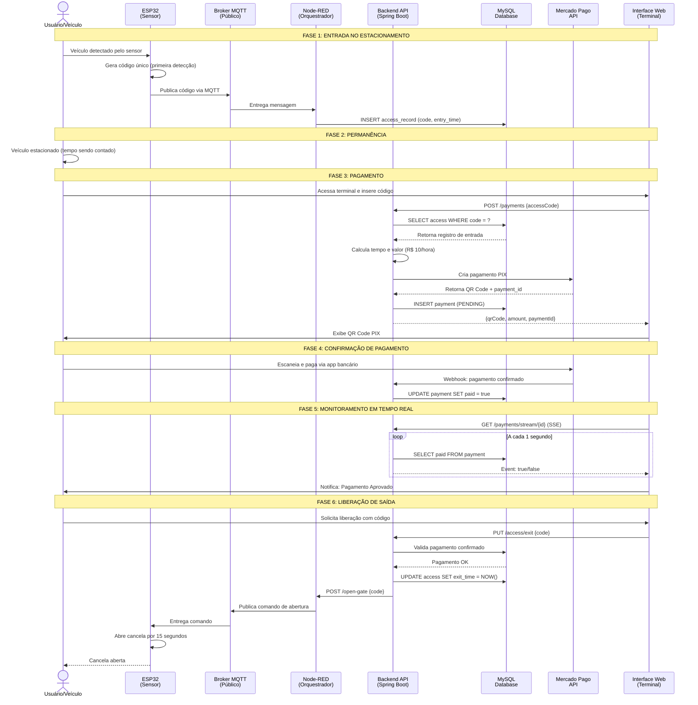
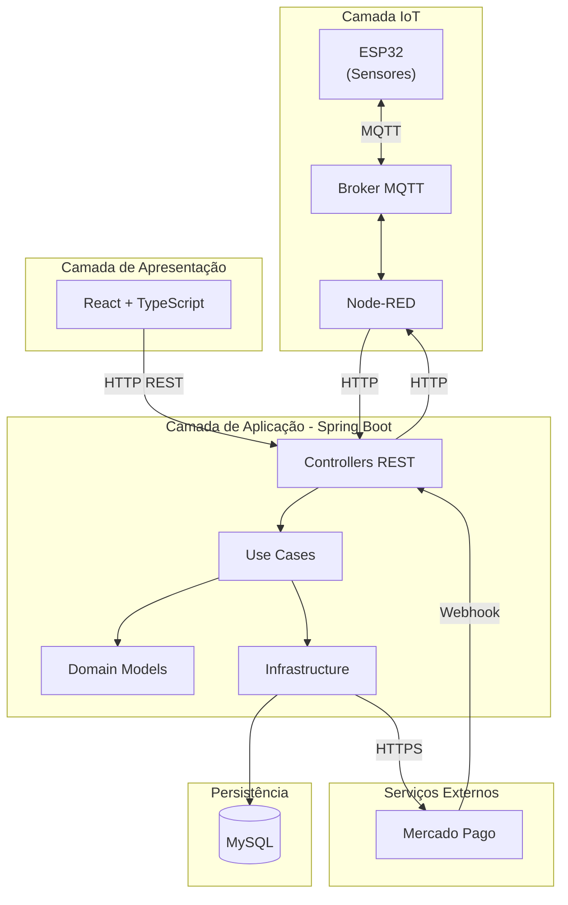

<div align="center">
  
# Libera.ai

### Sistema Inteligente de Gestão de Estacionamentos com IoT e Pagamento PIX

[](https://openjdk.java.net/)
[](https://spring.io/projects/spring-boot)
[](https://spring.io/)
[](https://www.mysql.com/)
[](https://www.mercadopago.com.br/)
[](https://www.docker.com/)
[](LICENSE)

</div>

---

## Índice

- [Problema](#problema)
- [Solução](#solução)
- [Fluxo do Sistema](#fluxo-do-sistema)
- [Tecnologias e Justificativas](#tecnologias-e-justificativas)
- [Arquitetura do Sistema](#arquitetura-do-sistema)
- [Estrutura do Repositório](#estrutura-do-repositório)
- [Configuração e Instalação](#configuração-e-instalação)
- [Documentação Técnica Detalhada](#documentação-técnica-detalhada)
- [Licença](#licença)

---

## Problema

Estacionamentos comerciais enfrentam diversos desafios operacionais que impactam diretamente a experiência do usuário e a eficiência do negócio:

**Processos Manuais e Lentos**
- Cobrança manual de tarifas propensa a erros de cálculo
- Filas longas nos caixas de pagamento, especialmente em horários de pico
- Necessidade de operadores humanos para cada transação

**Controle de Acesso Ineficiente**
- Cancelas operadas manualmente ou com sistemas desconectados
- Impossibilidade de rastrear tempo real de permanência
- Falta de integração entre entrada, permanência e saída

**Métodos de Pagamento Limitados**
- Dependência de dinheiro ou cartão físico
- Dificuldade em adotar pagamentos digitais modernos como PIX
- Processos de conciliação financeira complexos

**Sistemas Legados**
- Soluções antigas difíceis de escalar e manter
- Integração complexa com novos dispositivos IoT
- Falta de visibilidade em tempo real das operações

---

## Solução

O **Libera.ai** é uma plataforma completa que automatiza todo o ciclo operacional do estacionamento, desde a detecção da entrada até a liberação da saída com pagamento validado.

O sistema utiliza sensores IoT (ESP32) para detectar veículos automaticamente, comunicação MQTT para transmissão de dados em tempo real, processamento de pagamentos via PIX com o Mercado Pago, e uma interface web responsiva para interação do usuário.

### Componentes da Solução

| Componente | Função | Tecnologia Principal |
|------------|--------|----------------------|
| **Detecção de Entrada** | Sensores identificam veículos e geram código único | ESP32 + Sensor |
| **Comunicação IoT** | Transmissão de eventos entre dispositivos | MQTT + Broker Público |
| **Orquestração** | Recebe eventos MQTT e interage com backend | Node-RED |
| **Backend API** | Lógica de negócio e integração de pagamentos | Spring Boot + WebFlux |
| **Pagamentos** | Geração de QR Code PIX e confirmação | Mercado Pago SDK |
| **Interface Web** | Terminal de pagamento e liberação de saída | React + TypeScript |
| **Banco de Dados** | Persistência de acessos e pagamentos | MySQL |

### Diferenciais

- **Pagamento PIX**: Método de pagamento instantâneo e sem taxas para o usuário
- **Tempo Real**: Atualizações de status via Server-Sent Events (SSE)
- **Automação Completa**: Desde a detecção até a liberação sem intervenção humana
- **Arquitetura Moderna**: Clean Architecture e DDD para escalabilidade e manutenção

---

## Fluxo do Sistema

O sistema opera em um ciclo completo que vai desde a detecção de entrada do veículo até a liberação de saída após pagamento confirmado.

### Diagrama de Fluxo Completo



### Detalhamento das Fases

| Fase | Descrição | Componentes Envolvidos |
|------|-----------|------------------------|
| **1. Entrada** | Sensor ESP32 detecta veículo e gera código único. Código é publicado via MQTT e Node-RED insere no banco de dados. | ESP32, MQTT Broker, Node-RED, MySQL |
| **2. Permanência** | Veículo permanece no estacionamento. Sistema registra tempo de entrada para cálculo posterior. | MySQL |
| **3. Pagamento** | Usuário insere código no terminal web. Sistema calcula valor baseado no tempo e gera QR Code PIX via Mercado Pago. | Frontend, Backend, Mercado Pago |
| **4. Confirmação** | Usuário paga via PIX. Mercado Pago envia webhook ao backend confirmando pagamento. | Mercado Pago, Backend, MySQL |
| **5. Monitoramento** | Frontend mantém conexão SSE com backend, recebendo atualizações em tempo real sobre status do pagamento. | Frontend, Backend (WebFlux) |
| **6. Liberação** | Usuário solicita saída. Backend valida pagamento e envia comando via HTTP para Node-RED, que publica via MQTT para ESP32 abrir a cancela. | Frontend, Backend, Node-RED, MQTT, ESP32 |

---

## Tecnologias e Justificativas

A escolha de cada tecnologia foi baseada em requisitos técnicos e limitações do projeto acadêmico.

### Backend

| Tecnologia | Justificativa |
|------------|---------------|
| **Java 21** | Linguagem robusta com Virtual Threads para alta concorrência. Ecossistema maduro e ampla documentação. |
| **Spring Boot 3.5** | Framework padrão de mercado para APIs REST. Facilita configuração e integração com banco de dados e serviços externos. |
| **Spring WebFlux** | Suporte nativo a Server-Sent Events (SSE) para atualizações em tempo real sem polling constante do cliente. |
| **MySQL 8.0** | Banco de dados relacional confiável. Ideal para dados transacionais como acessos e pagamentos. |
| **Mercado Pago SDK** | SDK oficial para integração PIX. Suporte a QR Code dinâmico e webhooks para notificação de pagamento. |

### Frontend

| Tecnologia | Justificativa |
|------------|---------------|
| **React 19** | Biblioteca moderna para interfaces reativas. Facilita gerenciamento de estado durante fluxo de pagamento. |
| **TypeScript** | Tipagem estática previne erros em tempo de desenvolvimento. Melhora manutenção do código. |
| **Vite** | Build tool rápida com hot reload. Melhora produtividade durante desenvolvimento. |
| **TailwindCSS 4** | Estilização utilitária permite desenvolvimento rápido de interface responsiva sem CSS customizado extenso. |

### IoT e Comunicação

| Tecnologia | Justificativa |
|------------|---------------|
| **ESP32** | Microcontrolador com WiFi integrado. Baixo custo e amplamente usado em projetos IoT acadêmicos. |
| **MQTT** | Protocolo leve ideal para IoT. Comunicação assíncrona entre dispositivos com baixo consumo de recursos. |
| **Broker Público** | Elimina necessidade de infraestrutura própria para o projeto acadêmico. |
| **Node-RED** | Ferramenta visual para orquestração de fluxos IoT. Conecta MQTT ao backend sem necessidade de código complexo. |

### Infraestrutura

| Tecnologia | Justificativa |
|------------|---------------|
| **Docker** | Containerização garante ambiente consistente entre desenvolvimento e produção. |
| **Docker Compose** | Orquestração simples de múltiplos containers (frontend, backend, banco). |

---

## Arquitetura do Sistema

O backend foi projetado seguindo princípios de **Clean Architecture** e **Domain-Driven Design (DDD)**, organizando o código em bounded contexts independentes.

### Visão Geral



### Camadas do Backend

| Camada | Responsabilidade |
|--------|------------------|
| **Presentation** | Controllers REST, DTOs, validação de entrada |
| **Application** | Use Cases que orquestram lógica de negócio |
| **Domain** | Entidades e regras de negócio puras |
| **Infrastructure** | Repositórios JPA, integração Mercado Pago, comunicação Node-RED |

---

## Estrutura do Repositório

```
Libera.ai/
├── back/                          # Backend - API REST (Java/Spring Boot)
│   ├── src/
│   │   └── main/java/br/centroweg/libera_ai/
│   │       ├── module/
│   │       │   ├── access/           # Módulo de Controle de Acesso
│   │       │   │   ├── presentation/    # Controllers, DTOs
│   │       │   │   ├── application/     # Use Cases
│   │       │   │   ├── domain/          # Entidades, Portas
│   │       │   │   └── infrastructure/  # Repositórios, Adaptadores
│   │       │   │
│   │       │   └── payment/          # Módulo de Pagamentos
│   │       │       ├── presentation/    # Controllers, DTOs
│   │       │       ├── application/     # Use Cases
│   │       │       ├── domain/          # Entidades, Portas
│   │       │       └── infrastructure/  # Repositórios, Mercado Pago
│   │       │
│   │       └── share/            # Código compartilhado
│   │
│   ├── Dockerfile
│   ├── compose.yml
│   ├── pom.xml
│   └── README.md                 # Documentação técnica do backend
│
├── front/                        # Frontend - Interface Web
│   ├── src/
│   │   ├── api/                  # Cliente API
│   │   ├── components/           # Componentes React
│   │   ├── hooks/                # Hooks customizados (SSE)
│   │   ├── pages/                # Páginas da aplicação
│   │   └── types/                # Tipos TypeScript
│   │
│   ├── Dockerfile
│   ├── package.json
│   └── README.md                 # Documentação técnica do frontend
│
├── docker-compose.yml            # Orquestração completa
└── README.md                     # Este arquivo
```

---

## Configuração e Instalação

### Pré-requisitos

- Docker 20+ e Docker Compose 1.29+
- Token de acesso do Mercado Pago ([obter aqui](https://www.mercadopago.com.br/developers))
- Node-RED configurado com broker MQTT (para integração IoT completa)

### Configuração de Variáveis de Ambiente

Crie o arquivo `.env` na raiz do projeto:

```env
# Banco de Dados MySQL
DB_ROOT_PASSWORD=sua_senha_root_segura
DB_NAME=libera_db
DB_USER=libera_user
DB_PASSWORD=sua_senha_usuario_segura

# Mercado Pago
MERCADOPAGO_ACCESS_TOKEN=seu_access_token_mercadopago

# Node-RED (orquestrador IoT)
NODE_HOST=172.17.0.1
NODE_PORT=1880
```

### Execução com Docker Compose

```bash
# Iniciar todos os serviços
docker compose up -d --build

# Verificar status
docker compose ps

# Ver logs
docker compose logs -f
```

### Endpoints Disponíveis

| Serviço | URL | Descrição |
|---------|-----|-----------|
| Frontend | http://localhost:3000 | Interface web do terminal |
| Backend API | http://localhost:8080 | API REST |
| Health Check | http://localhost:8080/actuator/health | Status da aplicação |

### Variáveis de Ambiente

| Variável | Descrição |
|----------|-----------|
| `DB_ROOT_PASSWORD` | Senha root do MySQL |
| `DB_NAME` | Nome do banco de dados |
| `DB_USER` | Usuário do banco |
| `DB_PASSWORD` | Senha do usuário |
| `MERCADOPAGO_ACCESS_TOKEN` | Token de acesso Mercado Pago |
| `NODE_HOST` | Host do Node-RED |
| `NODE_PORT` | Porta do Node-RED |

---

## Documentação Técnica Detalhada

Para informações técnicas detalhadas sobre cada componente, consulte:

- **[Backend README](./back/README.md)**: Arquitetura, endpoints, integração Mercado Pago, decisões técnicas
- **[Frontend README](./front/README.md)**: Componentes React, hooks SSE, integração com API

---

## Licença

Este projeto está licenciado sob a **GNU General Public License v2.0**.

A GPL v2.0 garante aos usuários as liberdades de usar, estudar, compartilhar e modificar o software. Para mais detalhes, consulte o arquivo [LICENSE](LICENSE).

---

## Autores

**Centro WEG**

Projeto acadêmico desenvolvido com foco em arquitetura limpa, integração IoT e boas práticas de engenharia de software.
