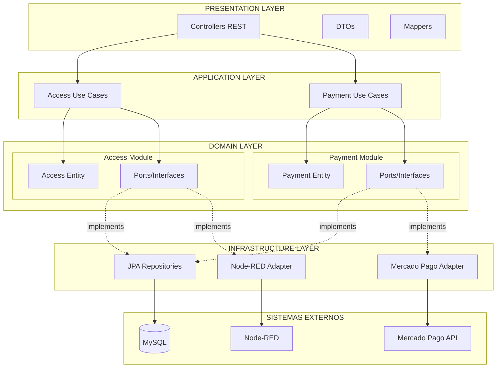

<div align="center">
  
# OpenIt - Backend

### API REST para Gestão de Estacionamentos

[](https://openjdk.java.net/)
[](https://spring.io/projects/spring-boot)
[](https://spring.io/)
[](https://www.mysql.com/)
[](https://www.mercadopago.com.br/)
[](https://www.docker.com/)

</div>

---

## Índice

- [Visão Geral](#visão-geral)
- [Tecnologias](#tecnologias)
- [Decisões Técnicas](#decisões-técnicas)
- [Arquitetura](#arquitetura)
- [Estrutura Modular](#estrutura-modular)
- [API Endpoints](#api-endpoints)
- [Configuração e Execução](#configuração-e-execução)
- [Integração Mercado Pago](#integração-mercado-pago)
- [Integração IoT](#integração-iot)

---

## Visão Geral

Backend da plataforma OpenIt desenvolvido em Java 21 com Spring Boot. Fornece APIs REST para controle de acesso de veículos e processamento de pagamentos via PIX.

### Funcionalidades

- Registro de entrada de veículos (via Node-RED)
- Cálculo de tarifa baseado em tempo de permanência
- Geração de pagamentos PIX via Mercado Pago
- Monitoramento de status em tempo real via SSE
- Validação de pagamento para liberação de saída
- Comunicação com Node-RED para acionamento de cancela

---

## Tecnologias

| Tecnologia | Versão | Propósito |
|------------|--------|-----------|
| Java | 21 LTS | Runtime com Virtual Threads |
| Spring Boot | 3.5.11 | Framework de aplicação |
| Spring WebFlux | 6.x | Programação reativa e SSE |
| Spring Data JPA | 3.x | ORM e persistência |
| Hibernate | 6.x | Implementação JPA |
| MySQL | 8.0 | Banco de dados relacional |
| Mercado Pago SDK | 2.1.27 | Integração de pagamentos |
| Lombok | Latest | Redução de boilerplate |

---

## Decisões Técnicas

### Por que Java 21 com Virtual Threads?

**Problema**: O sistema precisa lidar com múltiplas conexões SSE simultâneas e chamadas HTTP para Node-RED e Mercado Pago.

**Alternativas consideradas**:
1. **Thread Pool tradicional**: Limita número de conexões simultâneas
2. **Programação reativa completa**: Complexidade de código aumenta significativamente
3. **Virtual Threads**: Escala para milhares de conexões com código síncrono tradicional

**Decisão**: Virtual Threads permitem código síncrono simples com escalabilidade de soluções reativas.

```properties
spring.threads.virtual.enabled=true
```

### Por que Spring WebFlux para SSE?

**Problema**: O frontend precisa saber em tempo real quando o pagamento foi confirmado.

**Alternativas consideradas**:
1. **Polling do cliente**: Gera carga desnecessária no servidor
2. **WebSocket**: Bidirecional, mas desnecessário para este caso unidirecional
3. **Server-Sent Events**: Nativo HTTP, unidirecional, ideal para atualizações de status

**Implementação**:

```java
@GetMapping(path = "/stream/{paymentId}", produces = MediaType.TEXT_EVENT_STREAM_VALUE)
public Flux<Boolean> streamPaymentStatus(@PathVariable String paymentId) {
    return Flux.interval(Duration.ofSeconds(1))
            .map(tick -> getPaymentStatusUseCase.execute(paymentId))
            .distinctUntilChanged();
}
```

O `distinctUntilChanged()` evita eventos duplicados quando o status não muda.

### Por que Clean Architecture com DDD?

**Problema**: O sistema precisa integrar com múltiplos sistemas externos (Mercado Pago, Node-RED) e deve ser fácil de manter e testar.

**Decisão**: Separação em bounded contexts (Access e Payment) com camadas bem definidas:

| Camada | Responsabilidade | Dependências |
|--------|------------------|--------------|
| Presentation | Controllers, DTOs, validação | Application |
| Application | Use Cases, orquestração | Domain |
| Domain | Entidades, regras de negócio | Nenhuma |
| Infrastructure | JPA, APIs externas | Domain (via Ports) |

**Benefício**: Trocar Mercado Pago por outro gateway requer apenas novo Adapter, sem alterar lógica de negócio.

### Por que Hexagonal Architecture (Ports & Adapters)?

**Problema**: Integração com sistemas externos (Mercado Pago, Node-RED) deve ser desacoplada da lógica de negócio.

**Implementação**:

```java
// Port (interface no domínio)
public interface PaymentProvider {
    PaymentInfo generatePayment(double amount);
}

// Adapter (implementação na infraestrutura)
@Service
public class MercadoPagoPaymentProvider implements PaymentProvider {
    @Override
    public PaymentInfo generatePayment(double amount) {
        // Integração com SDK Mercado Pago
    }
}
```

### Por que Records para DTOs e Eventos?

**Problema**: DTOs e eventos de domínio devem ser imutáveis e thread-safe.

**Decisão**: Java Records garantem imutabilidade pelo compilador:

```java
public record ExitAccessEvent(int code) {}
public record PaymentInfo(String paymentId, String qrCode, double amount) {}
```

### Validação na Camada de Apresentação

**Problema**: Dados inválidos não devem chegar à camada de aplicação.

**Implementação**: Jakarta Bean Validation nos DTOs:

```java
public record CreatePaymentRequest(
    @NotNull(message = "Access code is required")
    @Positive(message = "Access code must be positive")
    Integer accessCode
) {}
```

---

## Arquitetura



---

## Estrutura Modular

```
src/main/java/br/centroweg/libera_ai/
│
├── Application.java                    # Bootstrap Spring Boot
│
├── module/
│   ├── access/                         # Módulo de Controle de Acesso
│   │   ├── presentation/
│   │   │   ├── controller/
│   │   │   │   └── AccessController.java
│   │   │   ├── dto/
│   │   │   │   ├── AccessExitRequest.java
│   │   │   │   └── AccessExitResponse.java
│   │   │   └── mapper/
│   │   │       └── AccessMapper.java
│   │   │
│   │   ├── application/
│   │   │   └── use_case/
│   │   │       └── AccessExitUseCase.java
│   │   │
│   │   ├── domain/
│   │   │   ├── model/
│   │   │   │   └── Access.java
│   │   │   ├── event/
│   │   │   │   └── ExitAccessEvent.java
│   │   │   └── port/
│   │   │       ├── AccessRepository.java
│   │   │       └── ExitEventProducer.java
│   │   │
│   │   └── infrastructure/
│   │       ├── persistence/
│   │       │   └── repository/
│   │       │       └── AccessRepositoryAdapter.java
│   │       └── producer/
│   │           └── NodeExitEventProducer.java
│   │
│   └── payment/                        # Módulo de Pagamentos
│       ├── presentation/
│       │   ├── controller/
│       │   │   └── PaymentController.java
│       │   ├── dto/
│       │   │   ├── CreatePaymentRequest.java
│       │   │   ├── PaymentResponse.java
│       │   │   └── MercadoPagoWebhookRequest.java
│       │   └── mapper/
│       │       └── PaymentMapper.java
│       │
│       ├── application/
│       │   └── use_case/
│       │       ├── CreatePaymentUseCase.java
│       │       ├── GetPaymentStatusUseCase.java
│       │       └── ProcessPaymentNotificationUseCase.java
│       │
│       ├── domain/
│       │   ├── model/
│       │   │   ├── Payment.java
│       │   │   └── PaymentInfo.java
│       │   └── port/
│       │       ├── PaymentRepository.java
│       │       └── PaymentProvider.java
│       │
│       └── infrastructure/
│           └── payment/
│               └── MercadoPagoPaymentProvider.java
│
└── share/
    └── config/                         # Configurações globais
```

---

## API Endpoints

### Módulo de Acesso

#### PUT /access/exit

Registra saída de veículo e aciona abertura da cancela.

**Request:**
```json
{
  "code": 12345
}
```

**Response (200 OK):**
```json
{
  "id": 1,
  "entryDate": "20/02/2026 08:00:00",
  "exitDate": "20/02/2026 17:30:00"
}
```

**Erros:**

| Código | Descrição |
|--------|-----------|
| 400 | Código inválido ou acesso não encontrado |
| 500 | Falha na comunicação com Node-RED |

### Módulo de Pagamentos

#### POST /payments

Cria pagamento e gera QR Code PIX.

**Request:**
```json
{
  "accessCode": 12345
}
```

**Response (201 Created):**
```json
{
  "paymentId": "550e8400-e29b-41d4-a716-446655440000",
  "qrCode": "iVBORw0KGgoAAAANSUhEUgAA...",
  "amount": 20.0
}
```

**Regra de Cálculo**: R$ 10,00 por hora, arredondado para cima.

#### GET /payments/stream/{paymentId}

Stream SSE para monitoramento de pagamento.

**Headers:**
```
Accept: text/event-stream
```

**Response:**
```
data: false

data: false

data: true
```

#### POST /payments/webhook

Webhook para notificações do Mercado Pago.

**Request (enviada pelo Mercado Pago):**
```json
{
  "action": "payment.updated",
  "data": {
    "id": "12345678"
  }
}
```

---

## Configuração e Execução

### Variáveis de Ambiente

```env
# Banco de Dados
DB_ROOT_PASSWORD=senha_root
DB_NAME=libera_db
DB_USER=libera_user
DB_PASSWORD=senha_usuario

# Mercado Pago
MERCADOPAGO_ACCESS_TOKEN=seu_token

# Node-RED
NODE_HOST=172.17.0.1
NODE_PORT=1880
```

### Docker Compose

```bash
docker compose up -d --build
```

### Desenvolvimento Local

```bash
./mvnw spring-boot:run
```

---

## Integração Mercado Pago

### Geração de Pagamento PIX

```java
@Service
public class MercadoPagoPaymentProvider implements PaymentProvider {
    
    @Override
    public PaymentInfo generatePayment(double amount) {
        PaymentCreateRequest request = PaymentCreateRequest.builder()
            .transactionAmount(BigDecimal.valueOf(amount))
            .paymentMethodId("pix")
            .payer(PaymentPayerRequest.builder()
                .email(defaultEmail)
                .build())
            .build();
            
        Payment payment = paymentClient.create(request);
        String qrCode = payment.getPointOfInteraction()
                               .getTransactionData()
                               .getQrCodeBase64();
        
        return new PaymentInfo(String.valueOf(payment.getId()), qrCode, amount);
    }
}
```

### Webhook de Confirmação

Mercado Pago envia notificação para `/payments/webhook` quando pagamento é confirmado. O `ProcessPaymentNotificationUseCase` atualiza o status no banco.

---

## Integração IoT

### Comunicação com Node-RED

O `NodeExitEventProducer` envia comandos HTTP para Node-RED abrir a cancela:

```java
@Component
public class NodeExitEventProducer implements ExitEventProducer {

    @Override
    public void send(ExitAccessEvent event) {
        try {
            log.info("Enviando sinal de liberação para código: {}", event.code());
            restTemplate.postForEntity(nodeUrl, event, Void.class);
        } catch (Exception e) {
            log.error("Falha na comunicação com Node-RED: {}", e.getMessage());
            throw new RuntimeException("Erro de integração IoT", e);
        }
    }
}
```

Node-RED recebe o comando HTTP e publica via MQTT para o ESP32.

---

## Licença

GNU General Public License v2.0

---

<div align="center">

**Desenvolvido por Centro WEG**

</div>
