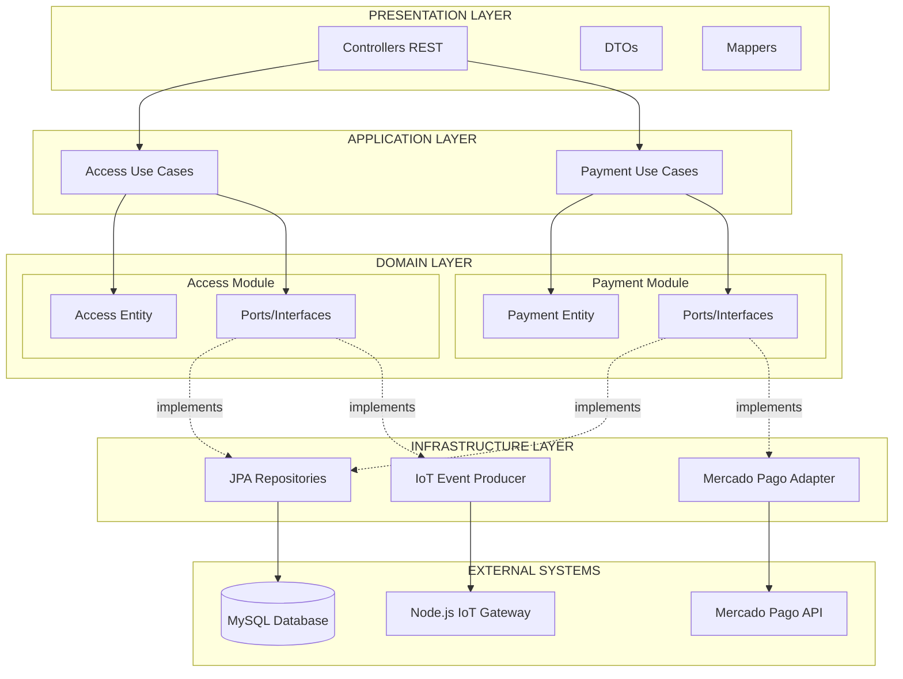
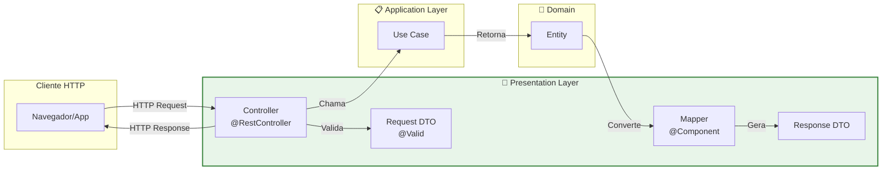
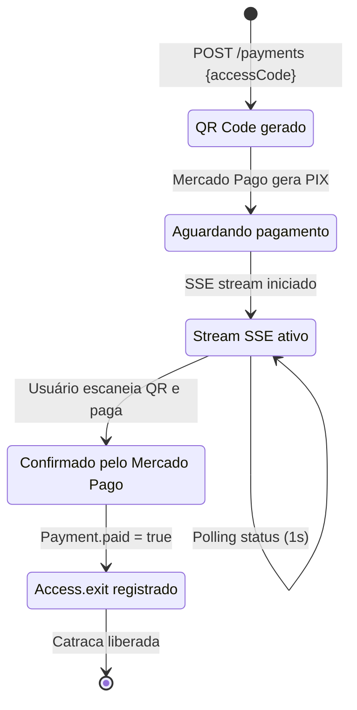
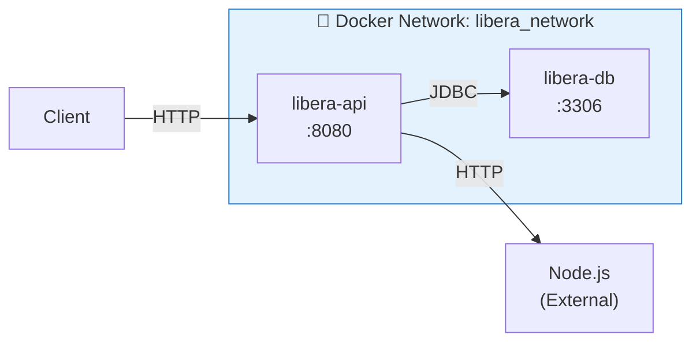
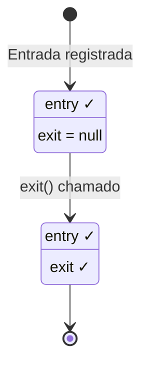

<div align="center">
  
# Libera.ai - Backend

### API REST para Gestão de Estacionamentos

[](https://openjdk.java.net/)
[](https://spring.io/projects/spring-boot)
[](https://spring.io/)
[](https://www.mysql.com/)
[](https://www.mercadopago.com.br/)
[](https://www.docker.com/)

</div>

---

## Sobre o Backend

Backend da plataforma Libera.ai desenvolvido em Java 21 com Spring Boot. Fornece APIs REST para controle de acesso de veículos e processamento de pagamentos via PIX, utilizando Clean Architecture e DDD para modularidade e escalabilidade.

### Principais Características

- **Arquitetura Modular**: Bounded Contexts separados (Access e Payment)
- **Clean Architecture**: Separação clara em camadas (Presentation, Application, Domain, Infrastructure)
- **Programação Reativa**: Spring WebFlux com Server-Sent Events para atualizações em tempo real
- **Java 21**: Virtual Threads para alta performance em operações I/O
- **Integração PIX**: Mercado Pago SDK para pagamentos instantâneos

---

## Índice

- [Tecnologias](#tecnologias)
- [Arquitetura](#arquitetura)
- [Estrutura Modular](#estrutura-modular)
- [API Endpoints](#api-endpoints)
- [Configuração e Execução](#configuração-e-execução)
- [Detalhes de Implementação](#detalhes-de-implementação)

---

## Tecnologias

### Backend Core

| Tecnologia | Versão | Propósito |
|------------|--------|-----------|
| Java | 21 LTS | Runtime principal com Virtual Threads |
| Spring Boot | 3.5.11 | Framework de aplicação |
| Spring WebFlux | 6.x | Programação reativa e Server-Sent Events |
| Spring Data JPA | 3.x | ORM e persistência de dados |
| Hibernate | 6.x | Implementação JPA |
| Lombok | Latest | Redução de boilerplate code |

### Integrações

| Tecnologia | Propósito |
|------------|-----------|
| Mercado Pago SDK | 2.1+ | Processamento de pagamentos PIX |
| Jakarta Validation | 3.x | Validação de entrada de dados |
| MySQL Driver | 8.0+ | Conexão com banco de dados |

### Infraestrutura

| Tecnologia | Propósito |
|------------|-----------|
| MySQL | 8.0 | Banco de dados relacional |
| Docker | 20+ | Containerização da aplicação |
| Docker Compose | 1.29+ | Orquestração de containers |

---

## Arquitetura

O backend utiliza **Clean Architecture** e **Domain-Driven Design (DDD)**, organizado em módulos independentes (Access e Payment) que representam Bounded Contexts distintos.

### Camadas da Arquitetura



**Camadas**:
- **Presentation**: Controllers REST que expõem endpoints HTTP
- **Application**: Use Cases que orquestram lógica de negócio
- **Domain**: Entidades e regras de negócio puras (Access e Payment modules)
- **Infrastructure**: Implementações técnicas (JPA, Mercado Pago, IoT)

---

## 🗂 Estrutura Modular

A aplicação está organizada em **módulos independentes** seguindo o padrão de **Bounded Contexts** do DDD. Cada módulo contém suas próprias camadas (Presentation, Application, Domain, Infrastructure).

```
src/main/java/br/centroweg/libera_ai/
│
├── Application.java                           # 🚀 Bootstrap da aplicação Spring Boot
│
├── module/                                    # 📦 BOUNDED CONTEXTS
│   │
│   ├── access/                                # Módulo de Controle de Acesso
│   │   ├── presentation/                      # 🎨 PRESENTATION LAYER
│   │   │   ├── controller/
│   │   │   │   └── AccessController.java      # REST Controller
│   │   │   ├── dto/
│   │   │   │   ├── AccessExitRequest.java     # DTO de entrada
│   │   │   │   └── AccessExitResponse.java    # DTO de saída
│   │   │   └── mapper/
│   │   │       └── AccessMapper.java          # Conversão Domain ↔ DTO
│   │   │
│   │   ├── application/                       # 📋 APPLICATION LAYER
│   │   │   └── use_case/
│   │   │       └── AccessExitUseCase.java     # Caso de uso de saída
│   │   │
│   │   ├── domain/                            # 💎 DOMAIN LAYER
│   │   │   ├── model/
│   │   │   │   └── Access.java                # Aggregate Root
│   │   │   ├── event/
│   │   │   │   └── ExitAccessEvent.java       # Evento de domínio
│   │   │   ├── port/
│   │   │   │   ├── AccessRepository.java      # Port de repositório
│   │   │   │   └── ExitEventProducer.java     # Port de eventos
│   │   │   └── exception/
│   │   │       └── AccessDomainException.java # Exceções de domínio
│   │   │
│   │   └── infrastructure/                    # ⚙️ INFRASTRUCTURE LAYER
│   │       ├── persistence/
│   │       │   ├── entity/
│   │       │   │   └── AccessEntity.java      # JPA Entity
│   │       │   └── repository/
│   │       │       ├── AccessRepositoryAdapter.java
│   │       │       └── JpaAccessRepository.java
│   │       └── producer/
│   │           └── NodeExitEventProducer.java # Adapter para Node.js
│   │
│   └── payment/                               # Módulo de Pagamentos
│       ├── presentation/                      # 🎨 PRESENTATION LAYER
│       │   ├── controller/
│       │   │   └── PaymentController.java     # REST Controller
│       │   ├── dto/
│       │   │   ├── CreatePaymentRequest.java  # DTO de criação
│       │   │   └── PaymentResponse.java       # DTO de resposta
│       │   └── mapper/
│       │       └── PaymentMapper.java         # Conversão Domain ↔ DTO
│       │
│       ├── application/                       # 📋 APPLICATION LAYER
│       │   └── use_case/
│       │       ├── CreatePaymentUseCase.java  # Criar pagamento
│       │       └── GetPaymentStatusUseCase.java # Consultar status
│       │
│       ├── domain/                            # 💎 DOMAIN LAYER
│       │   ├── model/
│       │   │   ├── Payment.java               # Aggregate Root
│       │   │   └── PaymentInfo.java           # Value Object
│       │   └── port/
│       │       ├── PaymentRepository.java     # Port de repositório
│       │       └── PaymentProvider.java       # Port de gateway de pagamento
│       │
│       └── infrastructure/                    # ⚙️ INFRASTRUCTURE LAYER
│           ├── persistence/
│           │   ├── entity/
│           │   │   └── PaymentEntity.java     # JPA Entity
│           │   └── repository/
│           │       ├── PaymentEntityRepository.java
│           │       └── PaymentEntityRepositoryJpa.java
│           ├── payment/
│           │   └── MercadoPagoPaymentProvider.java # Adapter Mercado Pago
│           ├── validator/
│           │   └── PaymentValidatorAdapter.java
│           └── exception/
│               └── PaymentIntegrationException.java
│
└── share/                                     # Componentes compartilhados
    └── (configurações globais, utilitários)
```

### 💡 Benefícios da Estrutura Modular

| Aspecto | Benefício |
|---------|-----------|
| **Separação de Contextos** | Cada módulo (Access, Payment) é independente e pode evoluir separadamente |
| **Escalabilidade** | Novos módulos podem ser adicionados sem impactar os existentes |
| **Testabilidade** | Cada camada pode ser testada isoladamente com mocks das dependências |
| **Manutenibilidade** | Mudanças em um módulo não afetam outros módulos |
| **Presentation Layer Isolada** | Controllers e DTOs desacoplados da lógica de negócio |

---

## 🎨 Camada de Apresentação (Presentation Layer)

A **Presentation Layer** foi introduzida como uma camada dedicada para isolar completamente a interface HTTP da lógica de negócio. Esta camada é responsável por:

### Responsabilidades

1. **Controllers REST**: Exposição de endpoints HTTP
2. **DTOs (Data Transfer Objects)**: Objetos que trafegam pela rede
3. **Mappers**: Conversão bidirecional entre DTOs e entidades de domínio
4. **Validação de Entrada**: Anotações Jakarta Validation (@Valid, @NotNull, etc.)

### Arquitetura da Presentation Layer



### Exemplo: AccessController

```java
@RestController
@RequestMapping("/access")
public class AccessController {
    
    private final AccessExitUseCase accessExitUseCase;
    private final AccessMapper mapper;
    
    @PutMapping("/exit")
    public ResponseEntity<AccessExitResponse> exit(
            @RequestBody @Valid AccessExitRequest request
    ) {
        // 1. Use Case processa a lógica de negócio
        var access = accessExitUseCase.execute(request);
        
        // 2. Mapper converte Domain Entity → DTO
        return ResponseEntity.ok(mapper.toResponse(access));
    }
}
```

### Benefícios da Separação

| Antes (sem Presentation Layer) | Depois (com Presentation Layer) |
|--------------------------------|----------------------------------|
| Controllers misturados com Application | Controllers isolados em Presentation |
| DTOs espalhados por diferentes camadas | DTOs centralizados em cada módulo |
| Difícil evoluir a API sem impactar domínio | API pode evoluir independentemente |
| Validação misturada com lógica de negócio | Validação declarativa na entrada |

---

## 💳 Sistema de Pagamentos

O **módulo Payment** implementa integração completa com o **Mercado Pago** para processamento de pagamentos via **PIX**, incluindo geração de QR Code e monitoramento em tempo real.

### Características do Sistema

- 🔢 **Cálculo Automático**: Taxa de R$ 10,00/hora com arredondamento para cima
- 📱 **QR Code PIX**: Geração dinâmica via API do Mercado Pago
- 🔄 **Monitoramento em Tempo Real**: Server-Sent Events (SSE) com polling a cada 1 segundo
- ✅ **Validação de Pagamento**: Bloqueio de saída até confirmação do pagamento
- 🏦 **Integração Robusta**: Uso do SDK oficial Mercado Pago Java v2.1.27

### Fluxo de Pagamento



### Entidade Payment

```java
public class Payment {
    private String id;              // UUID interno
    private Access access;          // Referência ao acesso
    private double amount;          // Valor calculado (R$)
    private boolean paid;           // Status do pagamento
    private String externalId;      // ID do Mercado Pago
    
    // Cálculo: R$ 10,00 por hora (arredondado para cima)
    public static Payment of(Access access) {
        long minutes = Duration.between(access.getEntry(), LocalDateTime.now()).toMinutes();
        double hours = Math.ceil(minutes / 60.0);
        double amount = hours * 10.0;
        return new Payment(UUID.randomUUID().toString(), access, amount);
    }
}
```

### Configuração do Mercado Pago

No arquivo `application.properties`:

```properties
# Mercado Pago Configuration
mercadopago.access-token=${MERCADOPAGO_ACCESS_TOKEN}
mercadopago.default-payer-email=parking@libera.ai.com
```

### API de Pagamentos

#### POST `/payments`

Cria um novo pagamento e retorna QR Code PIX.

**Request:**
```json
{
  "accessCode": 12345
}
```

**Response (201 Created):**
```json
{
  "paymentId": "550e8400-e29b-41d4-a716-446655440000",
  "qrCode": "base64_encoded_image...",
  "amount": 20.0
}
```

#### GET `/payments/stream/{paymentId}` (SSE)

Stream de eventos para monitorar status do pagamento em tempo real.

**Response (text/event-stream):**
```
data: false

data: false

data: true
```

### Integração com Mercado Pago

```java
@Service
public class MercadoPagoPaymentProvider implements PaymentProvider {
    
    @Override
    public PaymentInfo generatePayment(double amount) {
        PaymentCreateRequest request = PaymentCreateRequest.builder()
            .transactionAmount(BigDecimal.valueOf(amount))
            .paymentMethodId("pix")
            .payer(PaymentPayerRequest.builder()
                .email(defaultEmail)
                .build())
            .build();
            
        Payment payment = paymentClient.create(request);
        String qrCode = payment.getPointOfInteraction()
                               .getTransactionData()
                               .getQrCodeBase64();
        
        return new PaymentInfo(String.valueOf(payment.getId()), qrCode, amount);
    }
}
```

---

## 🚀 Setup & Running

### Pré-requisitos

- Docker 20+ e Docker Compose
- (Opcional) Java 21 e Maven 3.9+ para desenvolvimento local

### 1. Configuração do Ambiente

Crie o arquivo `.env` na raiz do projeto:

```env
# Banco de Dados
DB_ROOT_PASSWORD=sua_senha_root_segura
DB_NAME=libera_db
DB_USER=libera_user
DB_PASSWORD=sua_senha_segura
DB_PORT=3306

# Aplicação
APP_PORT=8080

# Integração Node.js
NODE_HOST=172.17.0.1
NODE_PORT=3000

# Mercado Pago (obtenha em https://www.mercadopago.com.br/developers)
MERCADOPAGO_ACCESS_TOKEN=seu_access_token_aqui
```

### 2. Executando com Docker Compose

```bash
# Build e inicialização completa
docker compose up -d --build

# Verificar status dos containers
docker compose ps

# Acompanhar logs
docker compose logs -f api
```

### 3. Verificando a Saúde do Sistema

```bash
# Health check da API
curl http://localhost:8080/actuator/health
```

### Arquitetura Docker



---

## 📊 Entidade Access

A entidade `Access` é o **Aggregate Root** do domínio, representando um registro de acesso com entrada e saída.

### Estrutura da Entidade

```java
public class Access {
    private final int id;           // Identificador único
    private final int code;         // Código do cartão/credencial
    private final LocalDateTime entry;  // Timestamp de entrada
    private LocalDateTime exit;     // Timestamp de saída (null = ativo)
}
```

### Schema do Banco de Dados

| Campo | Tipo | Descrição | Constraints |
|-------|------|-----------|-------------|
| `id` | `INT` | Identificador único | PK, AUTO_INCREMENT |
| `code` | `INT` | Código de acesso | NOT NULL |
| `entry` | `DATETIME` | Data/hora de entrada | NOT NULL |
| `exit` | `DATETIME` | Data/hora de saída | NULLABLE |

### Ciclo de Vida



---

## ⚡ Detalhes de Engenharia

### Spring Boot Layertools

O Dockerfile utiliza **multi-stage builds** com `spring-boot-layertools` para otimização de cache:

```dockerfile
# Stage 1: Build com extração de camadas
RUN mvn clean package -DskipTests -B && \
    java -Djarmode=layertools -jar target/*.jar extract --destination target/extracted

# Stage 2: Cópia otimizada por camadas
COPY --from=build /app/target/extracted/dependencies/ ./
COPY --from=build /app/target/extracted/spring-boot-loader/ ./
COPY --from=build /app/target/extracted/snapshot-dependencies/ ./
COPY --from=build /app/target/extracted/application/ ./
```

**Benefícios:**
- ✅ Rebuild apenas das camadas modificadas
- ✅ Cache eficiente de dependências Maven
- ✅ Imagens de produção menores (~150MB)

### Thread-Safety com DateTimeFormatter

O `AccessMapper` utiliza `DateTimeFormatter` de forma thread-safe:

```java
// ✅ Correto: DateTimeFormatter é imutável e thread-safe
private static final DateTimeFormatter FORMATTER = 
    DateTimeFormatter.ofPattern("dd/MM/yyyy HH:mm:ss");
```

**Por que isso importa:**
- `DateTimeFormatter` é imutável (diferente do legado `SimpleDateFormat`)
- Instância estática compartilhada entre todas as threads
- Zero overhead de sincronização

### Comunicação Resiliente com Node.js

O `NodeExitEventProducer` implementa comunicação HTTP com logging estruturado:

```java
@Override
public void send(ExitAccessEvent event) {
    try {
        log.info("Dispatching release signal for code: {}", event.code());
        restTemplate.postForEntity(nodeUrl, event, Void.class);
        log.info("Release signal successfully delivered to Node.js at: {}", nodeUrl);
    } catch (Exception e) {
        log.error("Failed to communicate with Node orchestrator...");
        throw new RuntimeException("IoT Integration Error...", e);
    }
}
```

**Pontos de Extensão:**
- Integração com Spring Cloud Circuit Breaker (Resilience4j)
- Retry automático com backoff exponencial
- Fallback para modo offline

---

## 🔌 API Endpoints

### Módulo de Acesso

#### PUT `/access/exit`

Registra a saída de um acesso ativo e aciona a liberação da catraca.

**Request:**
```json
{
  "code": 12345
}
```

**Response (200 OK):**
```json
{
  "id": 1,
  "entryDate": "20/02/2026 08:00:00",
  "exitDate": "20/02/2026 17:30:00"
}
```

**Erros:**

| Código | Descrição |
|--------|-----------|
| `400` | Código inválido ou acesso não encontrado |
| `500` | Falha na comunicação com Node.js |

---

### Módulo de Pagamentos

#### POST `/payments`

Cria um novo pagamento e gera QR Code PIX para um código de acesso.

**Request:**
```json
{
  "accessCode": 12345
}
```

**Response (201 Created):**
```json
{
  "paymentId": "550e8400-e29b-41d4-a716-446655440000",
  "qrCode": "iVBORw0KGgoAAAANSUhEUgAA...",
  "amount": 20.0
}
```

**Regra de Cálculo:**
- R$ 10,00 por hora
- Arredondamento para cima (ex: 1h15min = 2 horas = R$ 20,00)

**Erros:**

| Código | Descrição |
|--------|-----------|
| `400` | Código de acesso inválido |
| `500` | Falha na integração com Mercado Pago |

---

#### GET `/payments/stream/{paymentId}`

Monitora o status do pagamento em tempo real via Server-Sent Events (SSE).

**Headers:**
```
Accept: text/event-stream
```

**Response (Stream):**
```
data: false

data: false

data: true
```

**Comportamento:**
- Emite evento a cada 1 segundo
- `false`: Pagamento pendente
- `true`: Pagamento confirmado (stream pode ser fechado)
- Stream permanece aberto até o cliente fechar ou pagamento ser confirmado

---

## 📊 Modelo de Dados

### Entidade Access

| Campo | Tipo | Descrição | Constraints |
|-------|------|-----------|-------------|
| `id` | `INT` | Identificador único | PK, AUTO_INCREMENT |
| `code` | `INT` | Código de acesso | NOT NULL, UNIQUE para entradas ativas |
| `entry` | `DATETIME` | Data/hora de entrada | NOT NULL |
| `exit` | `DATETIME` | Data/hora de saída | NULLABLE (null = ainda no estacionamento) |

### Entidade Payment

| Campo | Tipo | Descrição | Constraints |
|-------|------|-----------|-------------|
| `id` | `VARCHAR(36)` | UUID interno | PK |
| `access_code` | `INT` | Código de acesso associado | FK → Access.code |
| `amount` | `DECIMAL(10,2)` | Valor a pagar (R$) | NOT NULL |
| `paid` | `BOOLEAN` | Status do pagamento | DEFAULT false |
| `external_id` | `VARCHAR(255)` | ID do Mercado Pago | NULLABLE |

---

## ⚡ Detalhes de Engenharia

### Arquitetura Modular com Bounded Contexts

A aplicação implementa **Domain-Driven Design (DDD)** com separação clara entre contextos:

- **Access Context**: Gerenciamento de entrada/saída de veículos
- **Payment Context**: Processamento de pagamentos e integração com Mercado Pago
- **Shared Kernel**: Componentes compartilhados (configurações, utilitários)

Cada contexto é independente e pode evoluir sem impactar os outros, facilitando escalabilidade e manutenção.

### Programação Reativa com WebFlux

O módulo de pagamentos utiliza **Spring WebFlux** para implementar Server-Sent Events (SSE):

```java
@GetMapping(path = "/stream/{paymentId}", produces = MediaType.TEXT_EVENT_STREAM_VALUE)
public Flux<Boolean> streamPaymentStatus(@PathVariable String paymentId) {
    return Flux.interval(Duration.ofSeconds(1))
            .map(tick -> getPaymentStatusUseCase.execute(paymentId))
            .distinctUntilChanged();
}
```

**Benefícios:**
- ✅ Comunicação assíncrona e não-bloqueante
- ✅ Atualizações em tempo real sem polling do cliente
- ✅ Eficiência de recursos com Reactive Streams

### Java 21 Virtual Threads

A aplicação está configurada para usar **Virtual Threads** do Project Loom:

```properties
spring.threads.virtual.enabled=true
```

**Vantagens:**
- Thread pool muito maior sem overhead de threads nativas
- Simplificação de código assíncrono
- Melhor performance em I/O-bound operations

### Ports & Adapters (Hexagonal Architecture)

Cada módulo define **Ports** (interfaces) no domínio que são implementados por **Adapters** na infraestrutura:

**Exemplo - Payment Module:**
```java
// Domain Port (Interface)
public interface PaymentProvider {
    PaymentInfo generatePayment(double amount);
}

// Infrastructure Adapter (Implementação)
@Service
public class MercadoPagoPaymentProvider implements PaymentProvider {
    // Integração com SDK do Mercado Pago
}
```

Isso permite trocar implementações (ex: Mercado Pago → PagSeguro) sem alterar a lógica de negócio.

### Docker Multi-Stage Builds

O Dockerfile utiliza **multi-stage builds** com `spring-boot-layertools` para otimização de cache:

```dockerfile
# Stage 1: Build com extração de camadas
RUN mvn clean package -DskipTests -B && \
    java -Djarmode=layertools -jar target/*.jar extract --destination target/extracted

# Stage 2: Cópia otimizada por camadas
COPY --from=build /app/target/extracted/dependencies/ ./
COPY --from=build /app/target/extracted/spring-boot-loader/ ./
COPY --from=build /app/target/extracted/snapshot-dependencies/ ./
COPY --from=build /app/target/extracted/application/ ./
```

**Benefícios:**
- ✅ Rebuild apenas das camadas modificadas
- ✅ Cache eficiente de dependências Maven
- ✅ Imagens de produção menores (~150MB)

### Thread-Safety e Imutabilidade

Uso de **Records Java** para DTOs e eventos de domínio:

```java
public record ExitAccessEvent(int code) {}
public record PaymentInfo(String paymentId, String qrCode, double amount) {}
```

**Vantagens:**
- Imutabilidade garantida pelo compilador
- Thread-safe por design
- Menos código boilerplate

### Validação Declarativa

Uso de **Jakarta Bean Validation** na camada de apresentação:

```java
public record CreatePaymentRequest(
    @NotNull(message = "Access code is required")
    @Positive(message = "Access code must be positive")
    Integer accessCode
) {}
```

Validação é feita automaticamente pelo Spring antes de chegar ao Use Case.

---

## 📜 Licença

Este projeto está licenciado sob a **GNU General Public License v2.0** - veja o arquivo [LICENSE](LICENSE) para detalhes.

---

<div align="center">

**Desenvolvido com ☕ Java e 💚 por Centro WEG**

</div>
